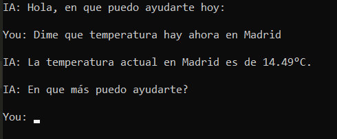

# Asistente Virtual Meteorológico

Este es un asistente virtual desarrollado en Python que permite a los usuarios consultar información meteorológica utilizando la API de Open Weather Map. El asistente procesa la información proporcionada por el usuario y devuelve datos sobre el clima actual del país dado.

## Tabla de Contenidos

- [Características](#características)
- [Instalación](#instalación)
- [Configuración](#configuración)
- [Uso](#uso)
- [Ejemplos](#ejemplos)
- [Licencia](#licencia)

## Características

- Consulta de datos meteorológicos en tiempo real.
- Soporte para múltiples ubicaciones.
- Facilidad de implementación.
- Conexión con una API meteorolócia para obtener datos precisos.

## Instalación

Para instalar el asistente virtual, asegúrese de tener Python 3.x instalado en su ssistema. Luego, ejecutar el siguiente comando para instalar las dependencias necesarias:

```bash
pip install -r requirements.txt
```

## Configuración

Antes de ejecutar el asistente virtual, es necesario configurar el archivo `data/config.json`. Asegúrese de proporcionar los siguientes parámetros según sus necesidades:

```json
{
	"OpenWeatherMap_ApiKey":"Su_API_KEY",
	"HuggingFace_ApiKey":"hf_SU_API_KEY",
	"model_name":"meta-llama/Llama-3.2-3B-Instruct",
	"max_tokens":500
}
```

* Nota: 
- Diríjase a la página openweathermap.org, regístrese y obtenga una API KEY en el apartado (https://home.openweathermap.org/api_keys).
- Accesa a huggingface.co y obtenga una API KEY
- En el apartado "model_name" puede establecer otro modelo que servirá para realizar una limpieza del texto y acatará las instrucciones que se le den. (Recomiendo no modificarlo)
- Como su nombre lo indica "max_tokens" es el número máximo de tokens que se van a usar en la generación de la respuesta.

## Uso

Para utilizar el asistente virtual, ejecuta el siguiente comando en su terminal y siga las instrucciones que se le brindan:

```shell
python main.py
```

## Ejemplos



## Licencia

[Licencia MIT](LICENSE).